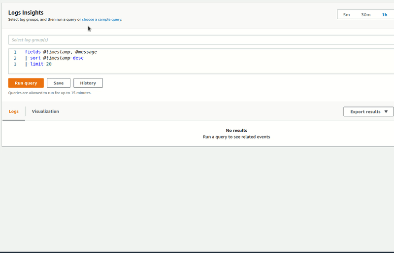

#  Insights Snippets Extension

Chrome extension that gives instant access to the CloudWatch Logs Insights snippets from [serverlessland.com/snippets](https://serverlessland.com/snippets)

## Features

When you are on the CloudWatch Logs Insights page in the AWS console an extra context menu item is added with all insights snippets from serverlessland.

## Install

This has not yet been published. To install:

* Clone the repo, run `npm install && npm run build` 
* In your browser, go to chrome://extensions
* Click `Load unpacked`
* Browse to and select <project root>/build

## Contribution

Suggestions and pull requests are welcomed!.

---

This project was bootstrapped with [Chrome Extension CLI](https://github.com/dutiyesh/chrome-extension-cli)

